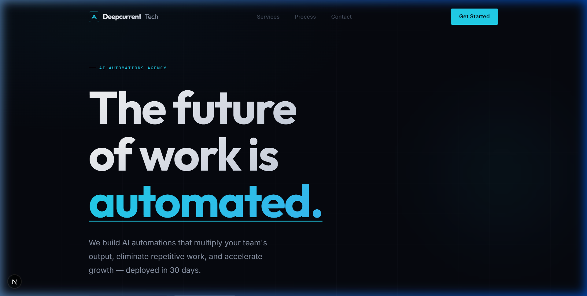
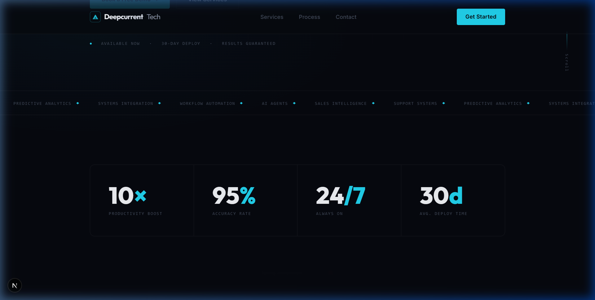
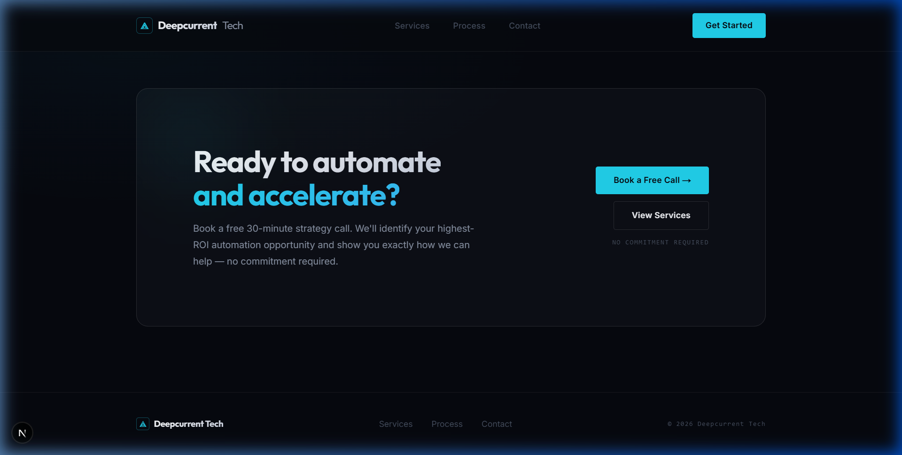

# Deepcurrent Tech — Website

Marketing landing page for **Deepcurrent Tech**, an AI Automations agency.

## Screenshots





## Stack

- **Framework** — [Next.js 16](https://nextjs.org) (App Router, Turbopack)
- **Language** — TypeScript
- **Styling** — Vanilla CSS / CSS Modules (no Tailwind)
- **Fonts** — Inter · Outfit (via `next/font/google`)

## Structure

```
src/app/
├── components/       # Shared UI components (Navbar, Footer, AnimateIn, etc.)
├── contact/          # /contact page
├── process/          # /process page
├── services/         # /services page
├── globals.css       # Design system: tokens, typography, buttons, animations
├── page.module.css   # Home page specific styles
├── page.tsx          # Main landing page (Home)
└── layout.tsx        # Root layout + font loading + metadata
```

## Pages & Sections

| Page | Section | Description |
|---|---|---|
| **Home** (`/`) | Hero | Full-viewport left-aligned display type (7-day deploy) |
| | Ticker | Scrolling marquee of services |
| | Stats | Bordered 4-cell grid (7d Avg. Deploy) |
| | Services | Overview of core AI capabilities |
| | Process | Summary of the 4-step delivery model |
| | CTA | Link to booking strategy call |
| **Services** (`/services`) | List | Deep-dive into all automation offerings |
| **Process** (`/process`) | Timeline | Detailed 7-day roadmap |
| **Contact** (`/contact`) | Form | Multi-field intake for new projects |

## Getting Started

> **Windows users:** Use `cmd` to avoid PowerShell execution policy errors.

```bash
# Development
cmd /c "npm run dev"

# Build
cmd /c "npm run build"

# Production server
cmd /c "npm start"
```

Open [http://localhost:3000](http://localhost:3000) in your browser.


